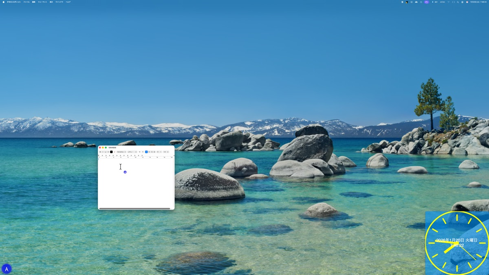
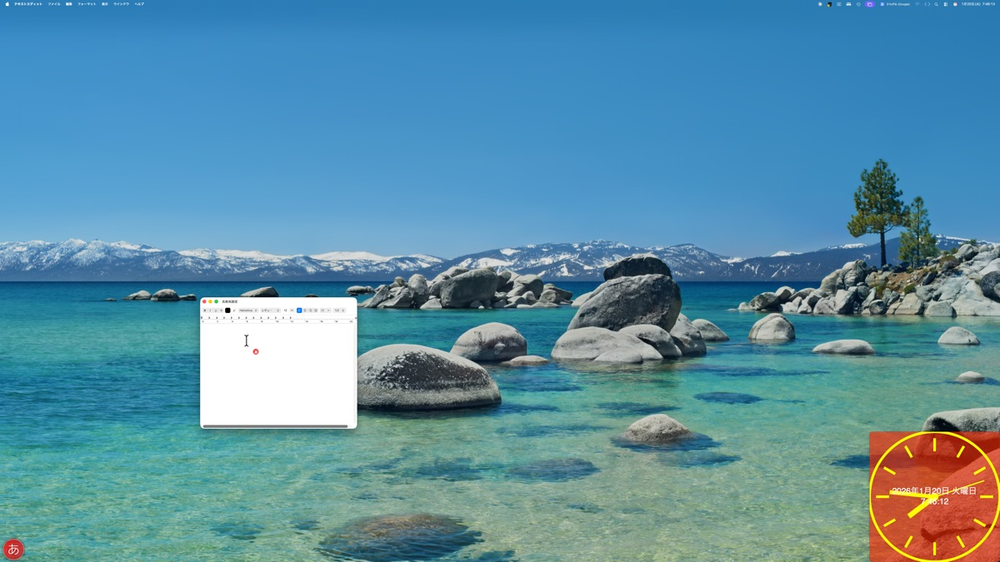

# IMEIndicatorClock

[English](README.md) | [日本語](README_ja.md) | [繁體中文](README_zh-Hant.md) | [简体中文](README_zh-Hans.md)

IME(입력기) 상태를 시각적으로 표시하고, 마우스 커서 근처에 표시하며, 사용자 정의 가능한 데스크톱 시계를 제공하는 macOS 유틸리티 앱입니다.

## 스크린샷

### IME 상태 연동 데스크톱 시계
| IME OFF (영어) | IME ON (일본어) |
|:-------------:|:--------------:|
|  |  |

### 설정 화면
| IME 표시기 | 시계 | 마우스 커서 표시기 |
|:---------:|:----:|:----------------:|
|  |  |  |

### 다국어 UI
| 일본어 | 번체 중국어 |
|:------:|:---------:|
|  |  |

## 비전

**우리의 목표는 전 세계의 IME를 지원하는 것입니다.**

IME 사용자가 현재 입력 모드를 한눈에 확인할 수 있도록 돕는 것을 목표로 합니다.

## 기능

### IME 표시기
- 화면에 현재 입력기 상태를 시각적으로 표시

| 일본어 | 한국어 | 중국어(번체) | 중국어(간체) | 영어 |
|:------:|:------:|:----------:|:----------:|:----:|
|  |  |  |  |  |
| 빨강 "あ" | 보라 "가" | 진한 초록 "繁" | 초록 "简" | 파랑 "A" |

- 위치, 크기, 배경색, 글꼴, 글꼴 색상, 불투명도 사용자 정의 가능

### 데스크톱 시계
- 아날로그 및 디지털 모드를 지원하는 플로팅 시계
- 날짜 표시 지원
- IME 상태에 따른 배경색 전환 기능
- 창 크기, 글꼴 크기, 색상을 자유롭게 사용자 정의

### 마우스 커서 표시기
- 마우스 커서 근처에 IME 상태를 표시
- IME 표시기를 작게 표시
- 텍스트 입력 시 편리

### 통합 설정 & 빠른 접근
- 탭 전환 통합 설정 창으로 모든 기능을 한번에 관리
- 각 창의 오른쪽 클릭 메뉴로 설정에 빠르게 접근

## 언어 지원

### 완전 지원 (IME 감지 + UI)
| 언어 | IME 감지 | UI 번역 |
|------|:--------:|:-------:|
| 일본어 | ✅ | ✅ |
| 영어 | ✅ | ✅ |
| 중국어(간체) | ✅ | ✅ |
| 중국어(번체) | ✅ | ✅ |
| 한국어 | ✅ | ✅ |

### IME 감지 + 기본 UI
| 언어 | IME 감지 | UI 번역 |
|------|:--------:|:-------:|
| 태국어 | ✅ | ✅ |
| 베트남어 | ✅ | ✅ |
| 아랍어 | ✅ | ✅ |
| 히브리어 | ✅ | ✅ |
| 힌디어 | ✅ | ✅ |
| 러시아어 | ✅ | ✅ |
| 그리스어 | ✅ | ✅ |

*이러한 언어의 UI 번역은 기계 번역으로, 개선이 필요할 수 있습니다. 기여를 환영합니다!*

## 시스템 요구 사항

- macOS 14.0 (Sonoma) 이상
- Apple Silicon / Intel Mac 지원

## 설치

### 릴리스 다운로드 (권장)

1. [Releases](https://github.com/obott9/IMEIndicatorClock/releases)에서 최신 버전 다운로드
2. 다운로드한 파일 압축 해제
3. `IMEIndicatorClock.app`을 응용 프로그램 폴더로 이동
4. 앱 실행

### 소스에서 빌드

```bash
git clone https://github.com/obott9/IMEIndicatorClock.git
cd IMEIndicatorClock
open IMEIndicatorClock.xcodeproj
```

## 사용 방법

1. 앱을 실행하면 메뉴 바에 아이콘이 나타납니다
2. 메뉴 바 아이콘에서 각종 설정에 접근
3. 시계나 표시기는 설정 창이 열려 있을 때 원하는 위치로 드래그할 수 있습니다

## 필요한 권한

- **손쉬운 사용**: IME 상태 모니터링에 필요합니다. 첫 실행 시 권한을 요청합니다.

## 개발

이 프로젝트는 Anthropic의 [Claude AI](https://claude.ai/)와 공동 개발되었습니다.

Claude가 지원한 부분:
- 아키텍처 설계 및 코드 구현
- 다국어 현지화
- 문서 및 README 작성

## 지원

이 앱이 유용하다면 커피 한 잔 사주세요!

[](https://ko-fi.com/obott9)

## 기여

기여를 환영합니다! 특히:
- 번역 오류 확인
- 버그 보고 및 기능 요청

## 라이선스

MIT License - 자세한 내용은 [LICENSE](LICENSE) 파일을 참조하세요.
